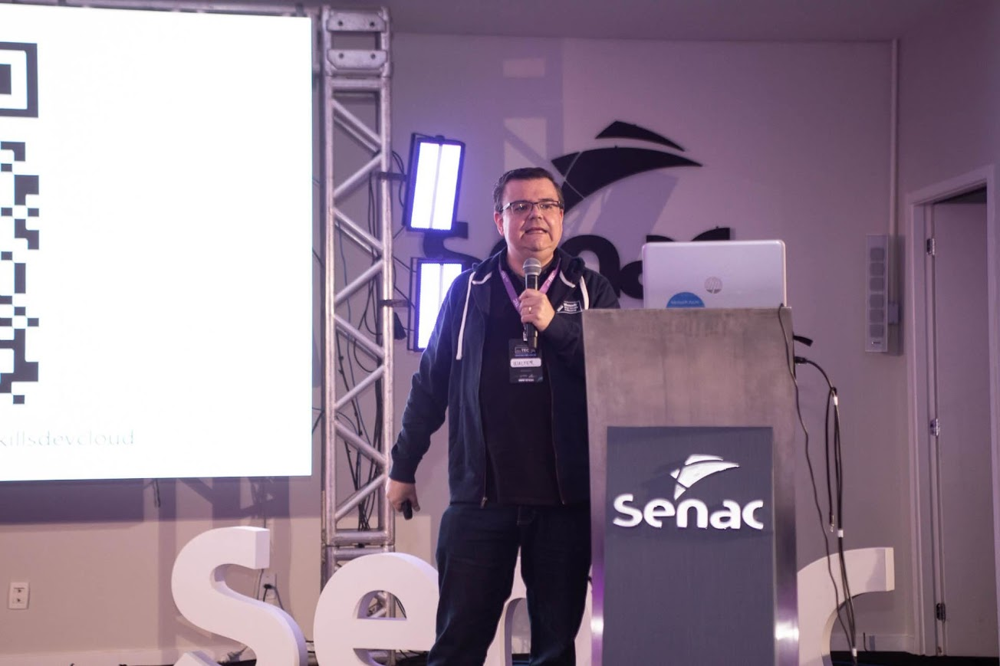
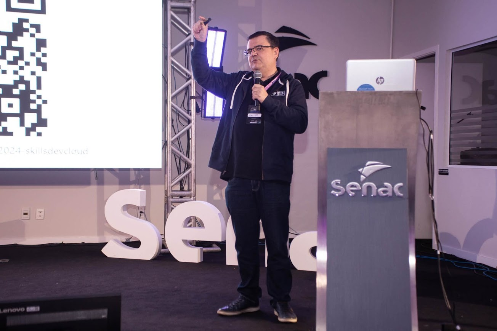
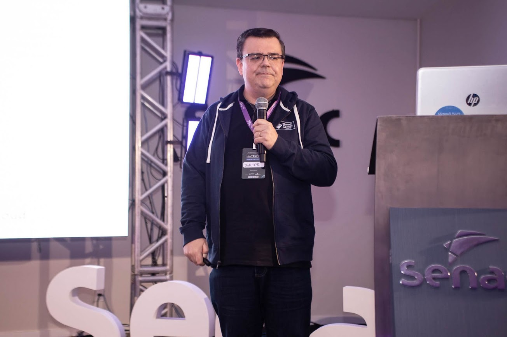

# devTEC 2024 - Habilidades que o Desenvolvedor deve ter sobre Computação em Nuvem
## 16/05 - Tubarão / SC

### Tecnologias
[](https://skillicons.dev)

### Proposta
A proposta da palestra é apresentar um conjunto de habilidades sobre computação em nuvem que os desenvolvedores devem possuir para estarem melhor preparados para o mercado de trabalho. Como por exemplo: conceitos básicos de sistemas distribuídos, sistemas de persistência sessão distribuídos, bancos de dados não relacionais e arquiteturas serverless.

### Slides
- [Download](slides/2024-05-14-devtec-v3.pdf)

### Fotos





### RBAC
- Cognitive Services Data Reader (Preview) 
- Cognitive Services User 
- Reader
- Storage Table Data Contributor 

## Deploy do serviço no Azure
[](https://portal.azure.com/#create/Microsoft.Template/uri/https%3A%2F%2Fraw.githubusercontent.com%2Fwaltercoan%2Fdevtec2024-skillsdevcloud%2Fmain%2Ftemplate.json)

### Deploy do código

```
mvn com.microsoft.azure:azure-webapp-maven-plugin:2.9.0:config
```
```
mvn package azure-webapp:deploy -DskipTests
```